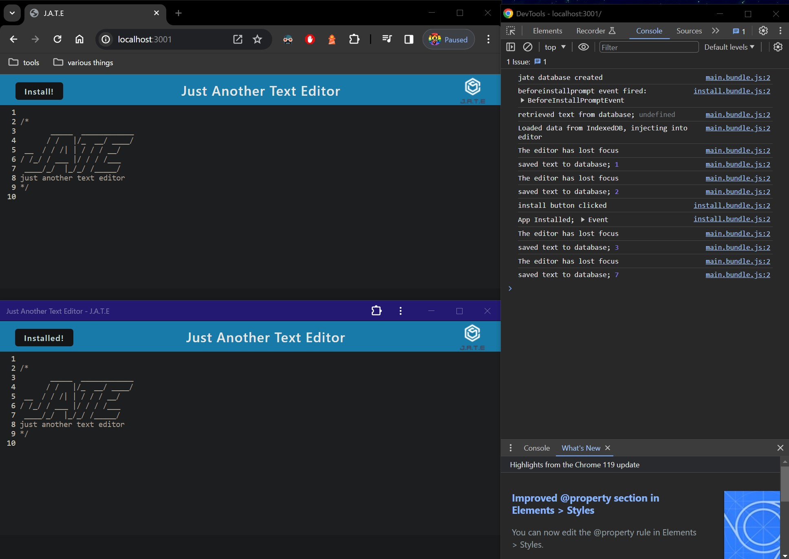

# Module 19 Weekly Challenge - PWA Text Editor 

## Description

This repository serves as a demo of data-persistence techniques & asset caching, plus the ability to 'download' a website as a 'Progressive Web Application' (PWA), allowing users to access a website as per a desktop application or mobile app.

## Usage

View the JATE text editor here;

https://pwa-text-editor-k4xy.onrender.com/

Upon opening the application, you will be presented with a basic text editor. Any text typed in this editor will be saved in the cache, even if you close the page. Additionally, you can install the application as a PWA by clicking the 'Install' button in the top left, followed by accepting the install prompt in the top right. Note that not all browsers support this PWA installation functionality.

## Installation

To run the application locally, begin by installing the repository files & extract them to a dedicated folder.

Navigate to the repository a git bash shell (or equivalent), and type "npm run install" to install the application's dependencies. Next, type "npm run start" to build the webpack dist folder & start the application.

Next, open up a web browser and navigate to "http://localhost:3001/", where you should now find the application.

## Preview

## Credits

MIT License Badge (./README.md, line 1);
https://gist.github.com/lukas-h/2a5d00690736b4c3a7ba